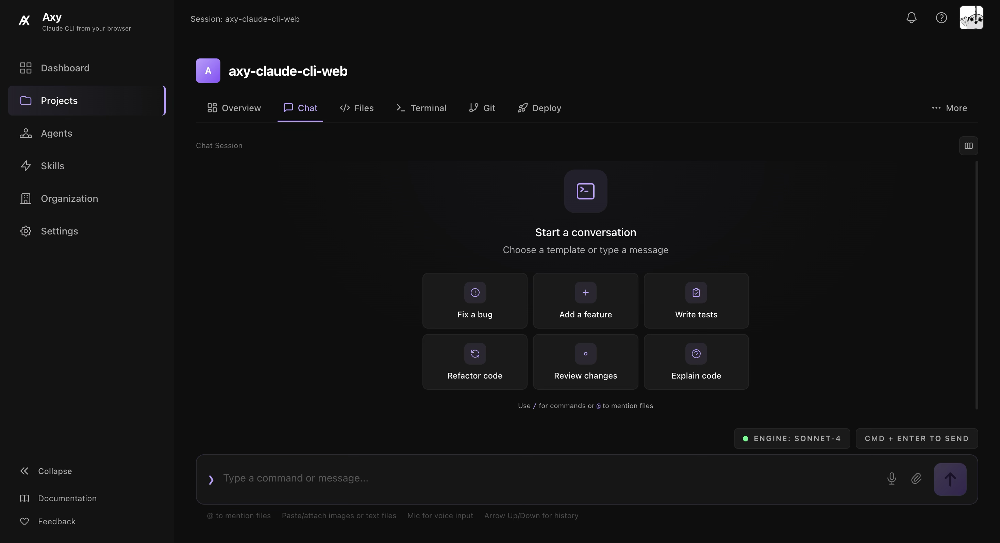

<p align="center">
  
</p>

<h1 align="center">Axy Web</h1>

<p align="center">
  <strong>A full-featured web interface for Claude CLI.</strong><br />
  Chat with AI, manage projects, deploy via SFTP, and more — all from your browser.
</p>

<p align="center">
  <a href="LICENSE"></a>
  <a href="https://github.com/Axy-Project/AxyWeb/releases"></a>
  <a href="https://github.com/Axy-Project/AxyWeb/pkgs/container/axyweb-server"></a>
  <a href="https://github.com/Axy-Project/AxyWeb/actions"></a>
</p>

<p align="center">
  <a href="#quick-install">Quick Install</a> &bull;
  <a href="#features">Features</a> &bull;
  <a href="docs/API.md">API Docs</a> &bull;
  <a href="docs/ARCHITECTURE.md">Architecture</a> &bull;
  <a href="docs/DEPLOYMENT.md">Deployment Guide</a> &bull;
  <a href="CONTRIBUTING.md">Contributing</a>
</p>

---

<!-- Screenshots: replace these placeholders with actual screenshots -->
<p align="center">
  
</p>

## Quick Install

Deploy the full stack with a single command:

```bash
curl -fsSL https://raw.githubusercontent.com/Axy-Project/AxyWeb/main/scripts/install.sh | bash
```

This pulls pre-built Docker images, generates secrets, and starts everything. Open `http://localhost:3457` and complete the setup wizard.

## Features

### Chat & AI

- **Streaming chat** with Claude CLI (tool calls, thinking blocks, artifacts)
- **Agent system** with 15+ pre-built templates and custom agent creation
- **Skill system** with 45+ built-in skills (code review, refactoring, testing, and more)
- **Artifact preview** for HTML, Markdown, Mermaid diagrams, and SVG
- **Voice input**, image/file upload, session export (Markdown/JSON)
- **Slash commands** and chat prefill from notes
- **Session branching and forking** with automatic git branch creation

### Development Tools

- **Monaco code editor** with multi-tab editing and syntax highlighting
- **Split terminal** (xterm.js + node-pty) restricted to project directory
- **Git panel** with staging, commits, branches, merge, push/pull
- **GitHub integration** for PRs, issues, actions, and repo management
- **MCP server management** with Anthropic Registry browser and import
- **Workspace snapshots** (create, restore, diff via git tags)

### Project Management

- **Multi-project support** with upload, templates (7 presets), and GitHub clone
- **Organization and team support** with roles (owner, admin, member)
- **Task system** with cron scheduling and background execution
- **Global search** across projects, sessions, messages, and notes
- **Command palette** (Ctrl+K) and keyboard shortcuts
- **Activity feed** on dashboard

### Deployment & Infrastructure

- **Deploy pipelines** with SFTP auto-deploy on git push
- **Ports panel** with reverse proxy for dev servers
- **Auto-push to GitHub** and auto-deploy on change
- **Docker deployment** with Watchtower auto-updates
- **Setup wizard** with built-in auth (no external provider required)
- **Usage and cost dashboard** with budget alerts

## Manual Install

```bash
# Download compose file
mkdir axy-web && cd axy-web
curl -fsSL https://raw.githubusercontent.com/Axy-Project/AxyWeb/main/docker-compose.prod.yml -o docker-compose.yml
curl -fsSL https://raw.githubusercontent.com/Axy-Project/AxyWeb/main/.env.example -o .env

# Edit .env with your configuration
nano .env

# Start all services
docker compose up -d
```

Open `http://localhost:3457` to access the setup wizard.

## Architecture

```
axy-web/
├── apps/
│   ├── server/          # Express 5 + WebSocket backend (port 3456)
│   └── web/             # Next.js 15 frontend (port 3457)
├── packages/
│   └── shared/          # Shared TypeScript types and utilities
├── docker-compose.yml        # Build from source
├── docker-compose.prod.yml   # Pre-built images (recommended)
└── docker-compose.dev.yml    # Development overrides
```

For a detailed breakdown, see [docs/ARCHITECTURE.md](docs/ARCHITECTURE.md).

## Tech Stack

| Layer | Technology |
|-------|-----------|
| **Frontend** | Next.js 15, React 19, TypeScript, Tailwind CSS 4 |
| **Backend** | Express 5, WebSocket (ws), node-pty |
| **State Management** | Zustand |
| **Editor** | Monaco Editor (@monaco-editor/react) |
| **Terminal** | xterm.js |
| **Database** | PostgreSQL (production), SQLite via better-sqlite3 (development) |
| **ORM** | Drizzle ORM |
| **Auth** | Built-in (email/password) or GitHub OAuth |
| **Git** | simple-git |
| **Deploy** | ssh2-sftp-client |
| **GitHub API** | Octokit |
| **Monorepo** | Turborepo + pnpm workspaces |
| **Diagrams** | Mermaid |
| **Markdown** | react-markdown + remark-gfm |
| **Containerization** | Docker multi-stage builds |

## Environment Variables

Copy `.env.example` to `.env` and configure:

| Variable | Required | Default | Description |
|----------|----------|---------|-------------|
| `DB_PASSWORD` | **Yes** | — | PostgreSQL password |
| `JWT_SECRET` | **Yes** | — | Secret for signing JWT tokens |
| `DB_USER` | No | `axy` | PostgreSQL username |
| `DB_PORT` | No | `5432` | PostgreSQL port |
| `SERVER_PORT` | No | `3456` | Backend API port |
| `WEB_PORT` | No | `3457` | Frontend port |
| `DATABASE_URL` | No | Auto | Full PostgreSQL connection string |
| `USE_SQLITE` | No | `false` | Use SQLite instead of PostgreSQL |
| `CLAUDE_PATH` | No | `claude` | Path to Claude CLI binary |
| `GITHUB_CLIENT_ID` | No | — | GitHub OAuth app client ID |
| `GITHUB_CLIENT_SECRET` | No | — | GitHub OAuth app client secret |
| `CORS_ORIGINS` | No | `*` | Comma-separated allowed origins |
| `PROJECTS_DIR` | No | `./data/projects` | Directory for project files |

## Auto-Updates

The production Docker Compose includes [Watchtower](https://containrrr.dev/watchtower/), which checks for new images every 5 minutes and performs rolling restarts with zero downtime.

Manual update:

```bash
docker compose pull && docker compose up -d
```

## Development

```bash
# Install dependencies
pnpm install

# Start both server and frontend in development mode
pnpm dev

# Or start individually
pnpm dev:server   # Express on http://localhost:3456
pnpm dev:web      # Next.js on http://localhost:3457
```

### Database

In development, Axy uses SQLite by default (zero configuration). For production, set `DATABASE_URL` to a PostgreSQL connection string.

```bash
# Generate migrations
pnpm db:generate

# Run migrations
pnpm db:migrate
```

## Contributing

See [CONTRIBUTING.md](CONTRIBUTING.md) for development setup, code style, and PR process.

## License

This project is licensed under the MIT License. See [LICENSE](LICENSE) for details.

## Acknowledgments

- [Anthropic](https://anthropic.com) for Claude and the Claude CLI
- [Monaco Editor](https://microsoft.github.io/monaco-editor/) for the code editing experience
- [xterm.js](https://xtermjs.org/) for the terminal emulator
- [Drizzle ORM](https://orm.drizzle.team/) for the database layer
- [Turborepo](https://turbo.build/) for monorepo tooling
